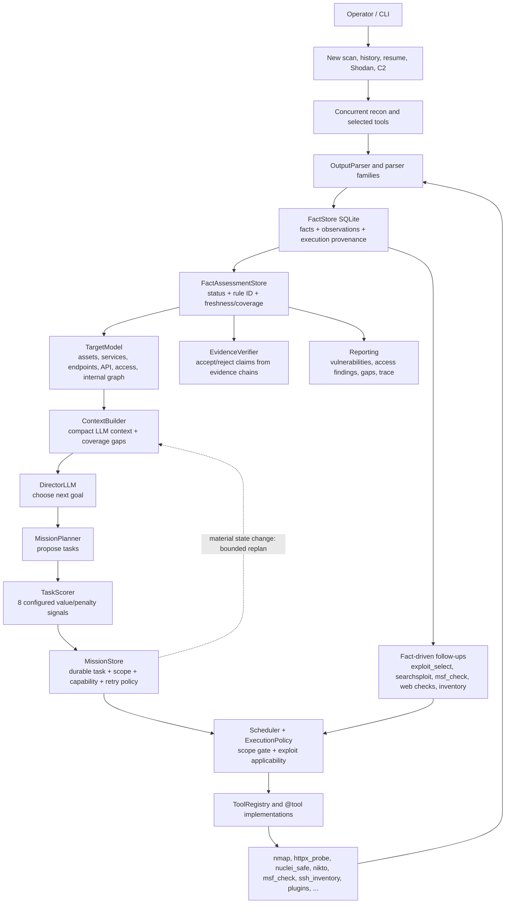

# OCTOPUS

Local AI-assisted security assessment engine for authorized labs, internal
audits, red-team exercises and security research.

OCTOPUS combines classic reconnaissance tools, a structured fact pipeline,
local LLM planning, credential/state memory, evidence verification, plugins,
reporting, OSINT, controlled post-access inventory and optional C2 components
inside one operator console.

The project is built around one rule: raw tool output is not enough. OCTOPUS
parses output into facts, stores those facts with provenance, resolves target
state, builds a target model and uses that state to choose the next useful
action.

## Scope And Responsibility

Use OCTOPUS only on systems you own or where you have explicit written
authorization to test. The framework contains dual-use capabilities. Operators
are responsible for scope, approvals, data handling, logs and compliance with
law, contracts and rules of engagement.

The default configuration keeps high-risk actions gated. Normal automation can
run discovery, safe checks, parsing, verification and controlled read-only
post-access inventory. Active Metasploit execution, persistence, arbitrary SSH
commands, C2 deployment, lateral movement, data exfiltration and cleanup are
opt-in and scope-controlled.

## What OCTOPUS Does

- Runs external reconnaissance and service fingerprinting.
- Maps web, API, TLS, DNS, ASM and browser-rendered surfaces.
- Runs safe template verification with Nuclei and records live findings.
- Imports Burp/ZAP/OpenAPI data and extracts GraphQL, JWT and JS route facts.
- Tracks credentials and access state across scans.
- Verifies exploit candidates with check-only tooling before active actions.
- Uses confirmed SSH access for controlled post-access inventory and internal
  network/service discovery.
- Maintains a structured target model instead of treating facts as plain text.
- Separates vulnerabilities, access findings and final risk explanation in
  reports.
- Supports plugins for exploit, persistence, evasion and assessment modules.
- Uses Ollama/local models; there is no cloud LLM requirement.

## How It Works



The loop is intentionally hybrid:

1. Tools produce bounded execution results and raw output.
2. Deterministic parsers extract typed facts with execution provenance.
3. Versioned assessments and freshness/coverage policy update the target model,
   stage gates and evidence usability without rewriting the observation.
4. The local LLM can suggest goals and plans from compact context.
5. Configurable scoring ranks task candidates, then the durable mission store
   persists dependencies, task scope, capability and retry policy.
6. Deterministic scheduling and final execution authorization gate every
   command; exploit commands also pass canonical assessment applicability.
7. Typed transient failures can consume only the task's persisted retry budget;
   material state changes can request only a bounded number of extra replans.
8. Reports are generated from assessed evidence, not free-form LLM text.

If the LLM returns empty or invalid output, OCTOPUS records the failure and uses
deterministic fallback planning. The pipeline should continue from facts instead
of losing state.

## Core Concepts

### Facts

Facts are the internal bus. A fact has a type, value, confidence, source and
observation history. Examples:

- `port_open -> 22/tcp (ssh) [OpenSSH 7.4]`
- `web_endpoint -> {"url": "http://10.0.0.5/"}`
- `nuclei_finding -> medium:CVE-2023-48795:10.0.0.5:22`
- `credential -> ssh_login_success:root@10.0.0.5`
- `system_access -> uid=0`
- `internal_service -> 172.24.108.2:53/tcp (dns)`
- `check_result -> {"kind": "internal_vulnerability_assessment", ...}`

Parsers prefer structured output and known tool families. Tools such as Nmap,
Nuclei, MSF and SSH inventory are owned by deterministic parsers so the LLM
does not invent ports, passwords or vulnerabilities from partial logs.

### Target Model

`core/ai/target_model.py` turns stored facts into a normalized model:

- assets and DNS names
- external services and banners
- web endpoints and web app notes
- API surface
- credentials and access
- internal hosts, subnets and services
- Active Directory, cloud, code and secret findings
- check results and coverage gaps
- negative facts and unknowns

The Director and Planner reason over this model, not over raw logs.

### Stage Gates

`core/ai/state_resolver.py` derives scan state:

- recon completed
- credentials found
- root access confirmed
- post-access inventory completed
- persistence established
- internal recon completed
- exfiltration completed
- cleanup completed

Root SSH login is treated as root-level access. Application sessions remain
application access unless OS-level evidence exists.

### Coverage Gaps

The target model exposes missing or degraded checks. For example:

- external vulnerability assessment pending for an observed service
- web mapping pending for an observed HTTP endpoint
- template verification timed out for an endpoint
- internal vulnerability assessment pending for a discovered internal service

Planner output is optimized against these gaps so the system moves toward
unanswered questions instead of repeating tools blindly.

### Durable Mission Lifecycle

`core/ai/mission_store.py` owns mission lifecycle schema `1.2` in the same
SQLite file as `FactStore`; facts remain the evidence authority. A durable task
stores its dependencies, task-level scope, capability, status and typed retry
policy. Attempts retain terminal outcomes plus bounded fact/execution links, so
a restart can fence abandoned work, recover it as `interrupted` and resume
pending tasks without treating task success as vulnerability proof.

The shipped mission policy allows two retries only for configured transient
classes: timeout, rate limit, transient network, provider unavailable and tool
unavailable. Failure completion and the eligible `failed -> pending` retry,
consumed budget and command-key grant commit atomically. Before a retry runs,
`ExecutionPolicy` is evaluated again and the persisted one-use command grant is
consumed; a retry is not a general authorization bypass.

After a plan finishes, mission control compares a deterministic signature of
state, next required capability, stage gates and assessment counts. A material
change requests an immediate planning pass without consuming the ordinary
iteration budget. Identical transitions are deduplicated and
`strategy.mission.max_state_replans` bounds these extra passes (default `3`).

### Configurable Task Scoring

`core/ai/task_scoring.py` applies schema `1.0` configuration to eight normalized
signals. Information gain, coverage value, verification value and path value
are rewards; cost, repetition, risk and uncertainty are penalties. Exact ties
use the canonical task ID. The score and every contribution are recorded for
decision traceability, but scoring neither grants capability nor authorizes
execution.

### Assessment, Freshness And Applicability

Fact assessment schema `1.1` keeps append-only `observed`, `inferred`,
`verified` and `contradicted` judgements with stable rule IDs, reasons, evidence
fact IDs and source execution IDs. Freshness policy `1.0` is a read-time view:
facts expose `fresh | stale | unknown` and `complete | degraded | unknown`
coverage without changing their stored confidence. The default maximum age is
24 hours, with shorter bounds for access/service status and six hours for
vulnerability facts.

Automatic corroboration requires two independent keyed execution IDs whose
latest persisted results succeeded within the configured policy window.
Automatic contradiction additionally requires opposite assertions with the
same scan, normalized target, fact type, semantic subject and policy window.
Failed, partial, timed-out or unrelated evidence cannot promote or contradict
a fact.

For `exploit_select`, `msf_check` and `msf_run`, the production compatibility
path applies the same canonical applicability rule as lifecycle action
adapters. If matching candidate facts exist and every match is contradicted,
stale or backed only by degraded coverage, dispatch is blocked. Unrelated facts
do not affect the decision, and absence of a matching candidate does not block
candidate discovery or a safe check. This evidence-usability gate is separate
from positive verification and final `ExecutionPolicy` authorization.

## Important Components

| Area | Files | Purpose |
| --- | --- | --- |
| CLI | `octopus.py`, `core/cli/` | Main console, scan history, Shodan flow, reports, C2 menu |
| AI pipeline | `core/ai/pipeline.py`, `core/ai/pipeline_*.py`, `core/ai/scan_loop.py`, `core/ai/runtime.py` | Public facade, decomposed mission/planning/replay/observability seams, scan lifecycle and canonical runtime I/O boundary |
| Mission lifecycle | `core/ai/mission_store.py`, `core/ai/pipeline_mission.py`, `core/ai/scan_loop.py` | Durable scope/capability, attempts, typed retries, crash recovery and bounded state-change replans |
| Director / Planner | `core/ai/director.py`, `core/ai/planner.py` | Local LLM goal and plan generation |
| Task scoring | `core/ai/task_scoring.py`, `core/ai/pipeline_planning.py` | Configurable eight-signal ranking and trace explanations |
| State and context | `core/ai/state_resolver.py`, `core/ai/context_builder.py` | Stage gates, coverage gaps, compact context |
| Evidence | `core/ai/evidence.py`, `core/ai/fact_assessment.py`, `core/ai/fact_store.py`, `core/ai/parsers/` | Parsing, provenance, versioned assessment, freshness and verification |
| Target model | `core/ai/target_model.py` | Typed representation of the target |
| Tool registry | `core/tools/`, `core/ai/tool_registry.py` | Registered tools and task mapping |
| Action lifecycle | `core/actions/` | Adapters, final policy authorization, provider selection and cleanup |
| Exploit selection | `core/exploits/selector.py`, `core/ai/exploit_applicability.py` | Maps services/banners to candidates and gates unusable assessed evidence |
| Credentials | `core/credentials.py` | Credential cache, DB sync, graph sync |
| Knowledge graph | `core/knowledge/` | Canonical entity identity and idempotent semantic projection |
| Plugins | `core/plugins/`, `modules/` | Class-based extension system |
| Reporting/trace | `core/ai/report_schema.py`, `core/ai/decision_trace.py`, `export.py` | Versioned evidence report, bounded decisions/metrics and exports |
| Benchmarks | `core/benchmarks/`, `benchmarks/scenarios/`, `benchmarks/results/`, `benchmarks/competitors/` | Built-in hermetic replay plus a separate manifest-driven, authorized competitor matrix and published comparison data |
| C2 | `core/c2/` | Optional daemon, implants, operators and channels |
| OSINT/browser | `shodan_module.py`, `core/osint/shardbrowser.py` | Shodan and ShardBrowser integrations |

## Tooling Overview

OCTOPUS tools are registered through `@tool(...)` and mapped to capabilities by
`ToolRegistry`.

Common categories:

- Service discovery: `nmap`
- External intelligence: `whois`, `dig`, `shodan`
- Web mapping: `httpx_probe`, `whatweb`, `curl_headers`, `scrapling`,
  `browser_surface_analysis`
- Web content/API: `ffuf`, `katana_crawl`, `scrapling_crawl`,
  `openapi_import`, `graphql_check`, `api_auth_check`
- Web checks: `security_headers_check`, `cors_check`, `jwt_analyze`,
  `js_route_extract`, `burp_import`, `zap_import`
- Template verification: `nuclei_safe`
- Vulnerability checks: `nikto`, `wpscan`, `sqlmap`, `jmx2rce_scan`
- Exploit intelligence: `exploit_select`, `searchsploit`, `msf_check`
- Post-access inventory: `ssh_inventory`, `network_recon`,
  `internal_service_probe`, `db_inventory`
- Windows/AD/Kerberos: `enum4linux`, `smbclient`, `ad_enum`,
  `bloodhound_ingest`, `gpo_review`, `adcs_review`, `asrep_roast`,
  `kerberoast`
- Code/cloud/secrets: `gitleaks_scan`, `trufflehog_scan`, `semgrep_scan`,
  `trivy_scan`, `checkov_scan`, `prowler_scan`, `scoutsuite_scan`
- Gated/manual actions: `msf_run`, `ssh_exec`, `socks_proxy`, `port_forward`,
  C2 deployment and active kill-chain stages

At this revision, the registry coverage command in Testing reports:

```text
covered/registered: 93/93
unknown: []
```

## Automation And Gating

Execution profiles:

- `auto`: normal pipeline-capable command
- `followup`: only emitted from facts or verification output
- `manual_gated`: callable only with explicit intent/configuration
- `legacy_wrapper`: compatibility wrapper
- `alias_wrapper`: alias around an existing implementation

Default safe posture in `config.yaml`:

```yaml
strategy:
  auto_post_access_inventory: true
  auto_ssh_inventory: true
  auto_internal_recon: true
  auto_payload_generation: false
  auto_persistence: false
  auto_data_exfil: false
  auto_cleanup: false
  allow_active_msf: false
  active_authorized: false
  authorized_targets: []
  max_active_msf_runs_per_scan: 1
  allow_arbitrary_ssh_exec: false
  mission:
    task_retry_budget: 2
    retryable_error_classes:
      - timeout
      - rate_limit
      - transient_network
      - provider_unavailable
      - tool_unavailable
    max_state_replans: 3
  task_scoring:
    schema_version: "1.0"
    weights:
      information_gain: 3.0
      coverage_value: 2.5
      verification_value: 2.0
      path_value: 2.0
      cost: 1.0
      repeat: 3.0
      risk: 1.5
      uncertainty: 1.5
```

Active Metasploit execution is only promoted when:

1. `exploit_select` emits a matching `msf_check`.
2. `msf_check` returns positive evidence for the same module and scope.
3. `strategy.allow_active_msf` is true.
4. `strategy.active_authorized` is true.
5. The target is inside `strategy.authorized_targets`.
6. The per-scan `max_active_msf_runs_per_scan` limit is not exhausted.

Promotion is still not dispatch authorization. Immediately before execution,
the scheduler runs `ExecutionPolicy`; the production assessment applicability
gate then rejects a matching candidate set when every assessment is
contradicted, stale or coverage-degraded.

## Installation

### Python

```bash
cd /path/to/Octopus
python3 -m venv venv
source venv/bin/activate
python -m pip install --upgrade pip wheel
pip install -r requirements.txt
```

### System Tools

Install the external commands you plan to use. Names differ by distribution,
but common tools include:

```bash
nmap curl whois ffuf nikto sqlmap metasploit exploitdb hashcat john
```

Optional tooling includes:

```text
rustscan, sslscan, enum4linux, smbclient, wpscan, nuclei, katana,
subfinder, dnsx, httpx, naabu, tlsx, waybackurls, gau, gitleaks,
trufflehog, semgrep, trivy, checkov, prowler, ScoutSuite, impacket,
ldap3, bloodhound-python, certipy, garble
```

### MariaDB / MySQL

Default configuration expects:

```sql
CREATE DATABASE octopus CHARACTER SET utf8mb4 COLLATE utf8mb4_unicode_ci;
CREATE USER 'octopus'@'localhost' IDENTIFIED BY '123';
GRANT ALL PRIVILEGES ON octopus.* TO 'octopus'@'localhost';
FLUSH PRIVILEGES;
```

Environment overrides:

```bash
export OCTOPUS_DB_HOST=localhost
export OCTOPUS_DB_USER=octopus
export OCTOPUS_DB_PASS=123
export OCTOPUS_DB_NAME=octopus
```

### Ollama

```bash
ollama serve
ollama create octopus-qwen -f Modelfile
```

Default model settings are in `config.yaml`:

```yaml
ollama:
  url: "http://localhost:11434/api/generate"
  model: "octopus-qwen"
```

Environment overrides:

```bash
export OCTOPUS_OLLAMA_MODEL=octopus-qwen
export OCTOPUS_OLLAMA_URL=http://localhost:11434/api/generate
```

### Secrets

Secrets should come from the environment or `.env`, not from committed files.

```bash
export SHODAN_API_KEY=...
export OCTOPUS_API_KEY=...
export OCTOPUS_C2_PSK=...
```

## Running

Start the console:

```bash
python3 octopus.py
```

Supervisor commands:

```bash
python3 octopus.py status
python3 octopus.py health
python3 octopus.py pid
python3 octopus.py stop
```

Main menu:

```text
[1] New Scan
[2] View History
[3] Resume Unfinished Scan
[4] C2 Server Management
[5] Exit
```

Direct scan mode creates a DB session, runs selected recon, feeds raw output
into the AI pipeline, records facts, runs fact-driven follow-ups and stores the
final summary.

Tool selector shortcuts:

```text
a  standard fast concurrent recon
n  standard plus smart extended coverage
x  exhaustive applicable safe/deep coverage; gated actions remain gated
```

Shodan mode can search, select hosts, save results and feed selected targets
into the same pipeline.

## Output, Reports And Trace

OCTOPUS stores:

- MariaDB scan history, findings, fixes, exploits attempted, summaries,
  credentials, Shodan results and tool results
- `data/facts.db` for facts/observations, command results, fact assessments and
  durable mission/task/attempt state
- `data/secrets.db` for encrypted secret values referenced opaquely by facts,
  missions, traces and reports
- `data/knowledge.db` for canonical KnowledgeGraph projections
- `data/provider-telemetry.db` and `data/decision-trace.db` when those lazy
  observability stores are used
- `data/c2.db` for C2 state
- `~/OCTOPUS/logs` for trace files
- `~/OCTOPUS/reports` for exports

Machine report schema `1.0` keeps nine operational classes separate:

- verified vulnerabilities;
- access findings;
- misconfigurations;
- observations;
- hypotheses/CVE/exploit candidates;
- attempted but unverified actions;
- coverage gaps;
- policy-blocked/degraded checks;
- cleanup outcomes.

A verified vulnerability requires a current verified assessment, evidence
chain, source execution IDs and an assessment reason. Root/access does not
become a vulnerability, and a CVE candidate does not become verified merely by
appearing in tool output. Human/legacy report fields remain compatibility
renderers.

Trace artifacts:

```text
~/OCTOPUS/logs/trace_<scan_id>.json
~/OCTOPUS/logs/trace_<scan_id>.txt
```

The JSON trace also contains bounded schema `1.0` decision events and derived
metrics such as time to first useful/verified evidence, parser yield,
duplicate/no-op, verification conversion, fallback/retry/timeout, resume
success and evidence completeness.

CLI trace inspection:

```bash
python3 octopus.py trace SCAN_ID TARGET
python3 octopus.py trace SCAN_ID TARGET json
```

## Replay And Debugging

Saved raw outputs can be replayed without rerunning external tools:

```python
from core.ai.pipeline import AIPipeline

pipeline = AIPipeline("data/facts.db")
result = pipeline.replay_outputs("scan-replay", "10.0.0.5", [
    {"tool": "nmap", "output": raw_nmap_text},
    {"tool": "nuclei_safe http://10.0.0.5", "output": raw_nuclei_text},
])

print(result["context"]["target_model"])
print(result["snapshot_actions"])
```

Replay snapshots can assert facts, next actions and surface states:

```python
from core.ai.replay_snapshot import ReplaySnapshot

ReplaySnapshot("/tmp/octopus_snapshot.db").assert_file_ok(
    "tests/fixtures/replay_snapshot_web_api.json"
)
```

## Hermetic Benchmarks

Benchmark scenario schema `1.0` defines ten replay categories under
`benchmarks/scenarios/`. `BenchmarkHarness()` needs no injected runner for this
catalog: the built-in runner exercises in-process fact/assessment persistence,
execution results, deterministic planner fallback and durable mission resume.
It does not start a scanner, network request, model provider or external tool.
Custom injected runners remain supported.

Run all ten scenarios with at least five repetitions each and write aggregates
under `benchmarks/results/builtin-catalog/`:

```bash
./venv/bin/python -m core.benchmarks
```

Regenerate only the published task-selection comparison:

```bash
./venv/bin/python -m core.benchmarks --comparison-only
```

The checked-in `benchmarks/results/noop-repeat-comparison-v1.json` is a
versioned `mission-frontier-replay-v1` measurement over six recorded candidate
frontiers with two selections per round. The legacy risk/time/cost baseline
selected 12/12 known no-op tasks and repeated 10/12 selections (rate
`0.833333`). The shipped eight-signal configuration selected 0/12 known no-op
tasks and repeated 0/12 selections. Thus the measured absolute reductions are
`1.0` for no-op rate and `0.833333` for repeated-task rate.

Those numbers measure only deterministic `TaskScorer` selection on the recorded
frontiers. They are not live-lab or external-scanner performance claims. The
artifact includes definitions, weights, every selected task and a
content-derived ID; the benchmark contract test regenerates it from code and
requires exact equality.

## Competitor Benchmarks

Live comparisons use a separate Linux-only, resettable and explicitly
authorized campaign under `benchmarks/competitors/`. The built-in hermetic
figures above are never mixed with live-system results. The pinned catalog and
launcher provide two full-system black-box profiles:

- `core`: OCTOPUS and Strix 1.1.0;
- `extended`: `core` plus PentAGI 2.1.0.

PentestGPT 1.0.0 remains cataloged only as a separate CTF/flag-capture
candidate. Its upstream non-interactive CLI hardcodes a CTF task and retries a
no-flag result three times, so it is not runnable or ranked in this discovery
campaign. Bootstrap it explicitly with `--with-pentestgpt` only for a separate
CTF methodology.

Run a live competitor campaign only inside a disposable, dedicated Linux VM
on an isolated VLAN. The VM must have no unrelated or long-lived credentials
or sensitive mounts; use only scoped, revocable benchmark provider keys. It
must not receive a Docker socket from a more privileged host. It must have no
sensitive/private-network reachability beyond the benchmark lab; allow only
the provider and bootstrap egress that the selected profile needs.
Third-party agents may invoke their own tools or Docker workloads, and the
launcher cannot prove their internal action stream. Consequently third-party
per-tool action conformance is `N/A` (`not assessed`), never inferred or
presented as enforced. Finding, evidence and coverage metrics remain comparable
against the shared scenario ground truth.

The extended adapter accepts only a private/internal PentAGI endpoint and
fails closed unless the service reports release 2.1.0 and its actual flow
provider/model telemetry matches the generated manifest. Deploy that service
as benchmark-dedicated infrastructure in the same isolated segment, never as a
route into a production private network. For an internal CA, set the optional
`OCTOBENCH_PENTAGI_CA_FILE`; its content digest enters runtime provenance.

Shannon 1.9.0 requires target source and belongs in a separate white-box
matrix. Framework-only claims are valid only after every system demonstrably
uses the same model, parameters, tool image, hardware, lab snapshot and
budgets.

On Linux x86_64 with glibc 2.34 or newer, Git, Docker Compose and CPython 3.12
installed, prepare the exact competitor revisions, the pinned `uv==0.11.28` installer and
the OCTOPUS runtime `venv/` from its checked-in hashed lock. Then copy the
credential template and make the private copy readable only by its owner:

```bash
./scripts/benchmarks/bootstrap_competitors_linux.sh --profile core
cp benchmarks/competitors/secrets.env.example benchmarks/competitors/secrets.env
chmod 600 benchmarks/competitors/secrets.env
```

Fill only the model/provider fields needed by the selected profile. Set both
blank acknowledgement variables to `YES` yourself only after confirming scope
and isolation. The launcher fails closed if either value is missing or differs
from `YES`.
The checked-in `STRIX_IMAGE` value is an immutable Linux amd64 digest; do not
replace it with a mutable tag or another digest.

```bash
./venv/bin/python -m core.benchmarks.competitors.launch \
  --campaign-id linux-blackbox-v1-20260716T120000Z \
  --profile core \
  --environment-file benchmarks/competitors/secrets.env
```

The versioned scenario lives under
`benchmarks/competitors/campaigns/linux-blackbox-v1/`. Generated manifests and
config go to `.benchmark-state/generated/<campaign-id>/`, resumable state goes
to `.benchmark-state/journal/<campaign-id>/`, and the immutable publication
bundle goes to `benchmarks/competitors/results/<campaign-id>/`. Use
`--prepare-only` to inspect generated inputs without executing systems.

Initial clones, environments and images can consume multiple gigabytes and
take tens of minutes. The counterbalanced launcher uses six repetitions for
both profiles per system/scenario pair; a live campaign can take tens
of minutes to hours and incur model, cloud or tool charges. Wall time and captured output
are hard-bounded, but vendor CLIs do not expose one uniform enforceable
token/tool/cost cutoff. Strix 1.1.0 also receives its native
`--max-budget-usd` limit; treat the shared declared values as conformance targets,
set provider-side spending limits, and publish unavailable telemetry as `N/A`
rather than zero. There is no default overall winner, and failed, timed-out,
partial or invalid repetitions remain visible.

Exact release SHAs, official links, license decisions, adapter protocol,
fairness controls and the publication checklist are in
`benchmarks/competitors/README.md`.

## Testing

Run the full test suite:

```bash
./venv/bin/python -m pytest tests/ -q
```

Fast hermetic suite:

```bash
./venv/bin/python -m pytest -q \
  -m "not slow and not external and not external_tools and not mysql and not platform"
```

Focused replay, security and benchmark contracts:

```bash
./venv/bin/python -m pytest -q -m replay
./venv/bin/python -m pytest -q -m security
./venv/bin/python -m pytest -q tests/benchmark -m benchmark
```

Static and dependency checks:

```bash
./venv/bin/python -m ruff check .
./venv/bin/python -m mypy
./venv/bin/python -m pip check
```

Compile check:

```bash
env PYTHONPYCACHEPREFIX=/tmp/octopus_pycache \
  ./venv/bin/python -m compileall -q core modules tests octopus.py tools.py
```

Registry coverage check:

```bash
./venv/bin/python -c 'import tools
from core.ai.tool_registry import ToolRegistry
from core.tools.registry import list_tools
r = ToolRegistry()
report = r.get_coverage_report([t.name for t in list_tools()])
print("covered/registered: " + str(report["covered"]) + "/" + str(report["registered"]))
print("unknown:", report["unknown"])'
```

## Repository Layout

```text
.
├── octopus.py              # main CLI
├── config.yaml             # primary runtime configuration
├── config.py               # config loader and environment overrides
├── db.py                   # MariaDB schema and history API
├── tools.py                # compatibility exports for registered tools
├── memory.py               # optional ChromaDB semantic memory
├── shodan_module.py        # Shodan discovery and persistence
├── msf.py                  # Metasploit wrapper
├── export.py               # PDF/report export
├── core/
│   ├── actions/            # unified provider/action lifecycle adapters
│   ├── ai/                 # pipeline, missions, facts, assessment, LLM, parsers
│   ├── benchmarks/         # schema, built-in replay runner, CLI and aggregation
│   ├── c2/                 # optional C2 daemon, implants, operators
│   ├── cli/                # shared CLI rendering helpers
│   ├── exploits/           # exploit selector and intelligence mapper
│   ├── killchain/          # post-access stages and AD modules
│   ├── knowledge/          # SQLite knowledge graph
│   ├── observability/      # audit and metrics
│   ├── opsec/              # artifact and transport helpers
│   ├── osint/              # ShardBrowser integration
│   ├── plugins/            # plugin SDK and loader
│   ├── recon/              # async recon engine
│   ├── tools/              # @tool implementations
│   └── transport/          # transport profiles and policies
├── modules/                # class-based plugins
├── benchmarks/scenarios/   # versioned replay benchmark catalog
├── benchmarks/results/     # published deterministic replay comparison data
├── benchmarks/competitors/ # separate external-system manifests and matrices
├── docs/                   # architecture, schemas, guides and release controls
├── payloads/               # payload helpers
├── vendor/                 # bundled third-party integrations
├── data/                   # local DBs and runtime state
└── tests/                  # regression tests and replay fixtures
```

## Extending OCTOPUS

### Adding a Tool

1. Add a function under `core/tools/` with `@tool(...)`.
2. Return output that is easy to parse.
3. Add or extend parser logic in `core/ai/parsers/` or `core/ai/evidence.py`.
4. Map the tool to a capability in `core/ai/tool_registry.py`.
5. Add scheduler/gating behavior if the tool is active or scope-sensitive.
6. Add regression tests with realistic output.
7. Check registry coverage.

For lifecycle-capable providers, follow
`docs/guides/action-adapter-authoring.md`; the adapter wraps the provider and
does not replace its public implementation.

### Adding a Plugin

1. Put the plugin under `modules/`.
2. Inherit from `OctopusPlugin`.
3. Implement `check()` and/or `run()`.
4. Return `CheckResult` or `PluginResult`.
5. Emit structured facts, artifacts and evidence.
6. Verify discovery through `PluginManager("modules/").list_plugins()`.

### Parser Quality Bar

Useful output should become facts. Fragile or high-value tools should have
deterministic parsers instead of falling back to LLM extraction. A parser should
avoid:

- storing raw passwords as facts
- creating open ports from filtered/partial output
- treating planning gaps as confirmed vulnerabilities
- advancing stage gates without OS-level evidence
- losing source/provenance for repeated observations

The complete parser checklist is in `docs/guides/parser-authoring.md`.

## Engineering Documentation

- Architecture ownership and contracts:
  `docs/architecture/current-system-map.md` and
  `docs/architecture/contracts-and-ownership.md`
- Mission lifecycle and task ranking:
  `docs/architecture/mission-lifecycle.md` and
  `docs/architecture/task-scoring.md`
- Fact assessment, freshness and applicability:
  `docs/architecture/fact-assessment.md`
- Evidence reports and observability:
  `docs/architecture/evidence-reporting-observability.md`
- SQLite schemas and migrations:
  `docs/schemas/sqlite-stores-and-migrations.md`
- Threat model: `docs/security/threat-model.md`
- Test and benchmark architecture: `docs/quality/test-architecture.md` and
  `docs/benchmarks/README.md`; competitor publication protocol:
  `benchmarks/competitors/README.md`
- Contribution and release process: `CONTRIBUTING.md` and
  `docs/release-checklist.md`

## Troubleshooting

### Ollama Is Not Running

```bash
ollama serve
ollama list
ollama create octopus-qwen -f Modelfile
```

### Database Connection Fails

```bash
mysql -u octopus -p octopus
```

Then verify the `db` section in `config.yaml` or the `OCTOPUS_DB_*`
environment variables.

### Tools Are Skipped

The registry skips unavailable tools and records blocked capabilities. Install
the missing binary or Python package and restart OCTOPUS.

### Shodan Is Disabled

```bash
pip install shodan
export SHODAN_API_KEY=...
```

### ShardBrowser Is Unavailable

Install Python dependencies and verify the vendor SDK path:

```text
vendor/shardbrowser/sdks/python/
```

### pytest Is Missing

```bash
source venv/bin/activate
pip install -r requirements.txt
```

## Current Status

This is an active local R&D codebase with production-like subsystems and legacy
compatibility wrappers. The intended quality bar is:

- registered tools are mapped and observable
- useful tool output becomes structured facts
- durable mission tasks preserve scope, capability, dependencies and typed
  retry policy across restart
- planner decisions follow facts and coverage gaps through configurable
  eight-signal scoring and bounded state-change replans
- fact judgements retain versioned assessment, freshness, evidence and
  execution provenance; unusable matching evidence blocks exploit dispatch
- long-running tools preserve partial findings
- access findings are not mixed with CVE-style vulnerabilities
- active actions require explicit scope and configuration
- reports explain risk from evidence
- decisions are bounded, redacted and metrically observable
- replay benchmarks publish at least five repetitions with median/variance and
  label deterministic task-selection measurements separately from live testing
- tests cover critical parser, policy, recovery, projection and report branches

## License / Warranty

No warranty is provided. Use only in authorized environments. The operator is
responsible for target scope, approvals, data handling and compliance.
