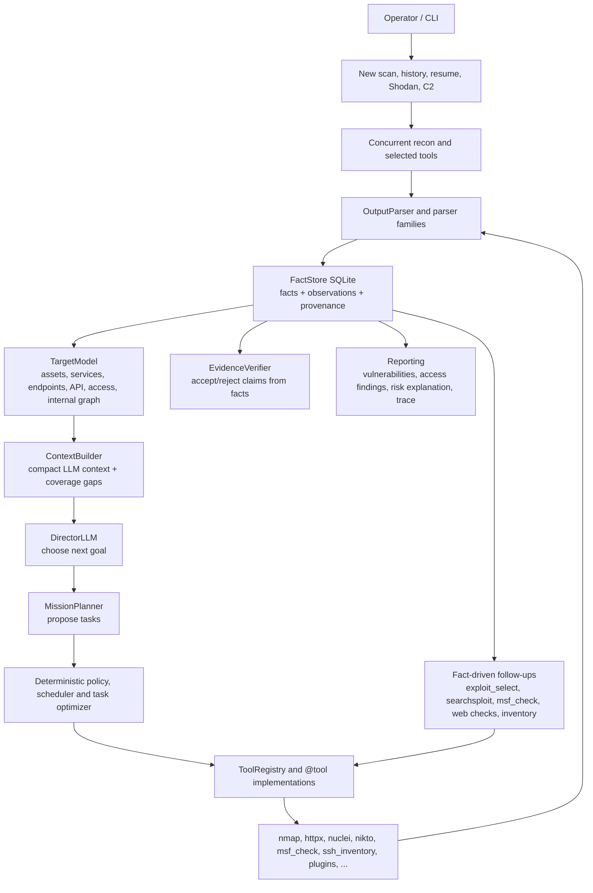

# OCTOPUS

Local AI-assisted security assessment engine for authorized labs, internal
audits, red-team exercises and security research.

OCTOPUS combines classic reconnaissance tools, a structured fact pipeline,
local LLM planning, credential/state memory, evidence verification, plugins,
reporting, OSINT, controlled post-access inventory and optional C2 components
inside one operator console.

The project is built around one rule: raw tool output is not enough. OCTOPUS
parses output into facts, stores those facts with provenance, resolves target
state, builds a target model and uses that state to choose the next useful
action.

## Scope And Responsibility

Use OCTOPUS only on systems you own or where you have explicit written
authorization to test. The framework contains dual-use capabilities. Operators
are responsible for scope, approvals, data handling, logs and compliance with
law, contracts and rules of engagement.

The default configuration keeps high-risk actions gated. Normal automation can
run discovery, safe checks, parsing, verification and controlled read-only
post-access inventory. Active Metasploit execution, persistence, arbitrary SSH
commands, C2 deployment, lateral movement, data exfiltration and cleanup are
opt-in and scope-controlled.

## What OCTOPUS Does

- Runs external reconnaissance and service fingerprinting.
- Maps web, API, TLS, DNS, ASM and browser-rendered surfaces.
- Runs safe template verification with Nuclei and records live findings.
- Imports Burp/ZAP/OpenAPI data and extracts GraphQL, JWT and JS route facts.
- Tracks credentials and access state across scans.
- Verifies exploit candidates with check-only tooling before active actions.
- Uses confirmed SSH access for controlled post-access inventory and internal
  network/service discovery.
- Maintains a structured target model instead of treating facts as plain text.
- Separates vulnerabilities, access findings and final risk explanation in
  reports.
- Supports plugins for exploit, persistence, evasion and assessment modules.
- Uses Ollama/local models; there is no cloud LLM requirement.

## How It Works



The loop is intentionally hybrid:

1. Tools produce raw output.
2. Deterministic parsers extract typed facts.
3. Facts update the target model and stage gates.
4. The local LLM can suggest goals and plans from compact context.
5. Deterministic policy normalizes, gates and deduplicates actions.
6. Follow-up tools run only when facts justify them.
7. Reports are generated from facts, not from free-form LLM text.

If the LLM returns empty or invalid output, OCTOPUS records the failure and uses
deterministic fallback planning. The pipeline should continue from facts instead
of losing state.

## Core Concepts

### Facts

Facts are the internal bus. A fact has a type, value, confidence, source and
observation history. Examples:

- `port_open -> 22/tcp (ssh) [OpenSSH 7.4]`
- `web_endpoint -> {"url": "http://10.0.0.5/"}`
- `nuclei_finding -> medium:CVE-2023-48795:10.0.0.5:22`
- `credential -> ssh_login_success:root@10.0.0.5`
- `system_access -> uid=0`
- `internal_service -> 172.24.108.2:53/tcp (dns)`
- `check_result -> {"kind": "internal_vulnerability_assessment", ...}`

Parsers prefer structured output and known tool families. Tools such as Nmap,
Nuclei, MSF and SSH inventory are owned by deterministic parsers so the LLM
does not invent ports, passwords or vulnerabilities from partial logs.

### Target Model

`core/ai/target_model.py` turns stored facts into a normalized model:

- assets and DNS names
- external services and banners
- web endpoints and web app notes
- API surface
- credentials and access
- internal hosts, subnets and services
- Active Directory, cloud, code and secret findings
- check results and coverage gaps
- negative facts and unknowns

The Director and Planner reason over this model, not over raw logs.

### Stage Gates

`core/ai/state_resolver.py` derives scan state:

- recon completed
- credentials found
- root access confirmed
- post-access inventory completed
- persistence established
- internal recon completed
- exfiltration completed
- cleanup completed

Root SSH login is treated as root-level access. Application sessions remain
application access unless OS-level evidence exists.

### Coverage Gaps

The target model exposes missing or degraded checks. For example:

- external vulnerability assessment pending for an observed service
- web mapping pending for an observed HTTP endpoint
- template verification timed out for an endpoint
- internal vulnerability assessment pending for a discovered internal service

Planner output is optimized against these gaps so the system moves toward
unanswered questions instead of repeating tools blindly.

## Important Components

| Area | Files | Purpose |
| --- | --- | --- |
| CLI | `octopus.py`, `core/cli/` | Main console, scan history, Shodan flow, reports, C2 menu |
| AI pipeline | `core/ai/pipeline.py` | Scan loop, task execution, follow-ups, trace |
| Director / Planner | `core/ai/director.py`, `core/ai/planner.py` | Local LLM goal and plan generation |
| State and context | `core/ai/state_resolver.py`, `core/ai/context_builder.py` | Stage gates, coverage gaps, compact context |
| Evidence | `core/ai/evidence.py`, `core/ai/parsers/` | Parsing, verification, fact normalization |
| Target model | `core/ai/target_model.py` | Typed representation of the target |
| Tool registry | `core/tools/`, `core/ai/tool_registry.py` | Registered tools and task mapping |
| Exploit selection | `core/exploits/selector.py` | Maps services/banners to candidates and check commands |
| Credentials | `core/credentials.py` | Credential cache, DB sync, graph sync |
| Knowledge graph | `core/knowledge/` | SQLite graph of assets, services, identities and vulns |
| Plugins | `core/plugins/`, `modules/` | Class-based extension system |
| Reporting | `core/ai/reporting.py`, `export.py` | Final outcome, PDF/export data |
| C2 | `core/c2/` | Optional daemon, implants, operators and channels |
| OSINT/browser | `shodan_module.py`, `core/osint/shardbrowser.py` | Shodan and ShardBrowser integrations |

## Tooling Overview

OCTOPUS tools are registered through `@tool(...)` and mapped to capabilities by
`ToolRegistry`.

Common categories:

- Service discovery: `nmap`, `rustscan`
- External intelligence: `whois`, `dig`, `shodan`
- Web mapping: `httpx_probe`, `whatweb`, `curl_headers`, `scrapling`,
  `browser_surface_analysis`
- Web content/API: `ffuf`, `katana_crawl`, `scrapling_crawl`,
  `openapi_import`, `graphql_check`, `api_auth_check`
- Web checks: `security_headers_check`, `cors_check`, `jwt_analyze`,
  `js_route_extract`, `burp_import`, `zap_import`
- Template verification: `nuclei_safe`
- Vulnerability checks: `nikto`, `wpscan`, `sqlmap`, `jmx2rce_scan`
- Exploit intelligence: `exploit_select`, `searchsploit`, `msf_check`
- Post-access inventory: `ssh_inventory`, `network_recon`,
  `internal_service_probe`, `db_inventory`
- Windows/AD/Kerberos: `enum4linux`, `smbclient`, `ad_enum`,
  `bloodhound_ingest`, `gpo_review`, `adcs_review`, `asrep_roast`,
  `kerberoast`
- Code/cloud/secrets: `gitleaks_scan`, `trufflehog_scan`, `semgrep_scan`,
  `trivy_scan`, `checkov_scan`, `prowler_scan`, `scoutsuite_scan`
- Gated/manual actions: `msf_run`, `ssh_exec`, `socks_proxy`, `port_forward`,
  C2 deployment and active kill-chain stages

Current registry coverage:

```text
93/93
unknown: []
```

## Automation And Gating

Execution profiles:

- `auto`: normal pipeline-capable command
- `followup`: only emitted from facts or verification output
- `manual_gated`: callable only with explicit intent/configuration
- `legacy_wrapper`: compatibility wrapper
- `alias_wrapper`: alias around an existing implementation

Default safe posture in `config.yaml`:

```yaml
strategy:
  auto_post_access_inventory: true
  auto_ssh_inventory: true
  auto_internal_recon: true
  auto_payload_generation: false
  auto_persistence: false
  auto_data_exfil: false
  auto_cleanup: false
  allow_active_msf: false
  active_authorized: false
  authorized_targets: []
  allow_arbitrary_ssh_exec: false
```

Active Metasploit execution is only promoted when:

1. `exploit_select` emits a matching `msf_check`.
2. `msf_check` returns positive evidence for the same module and scope.
3. `strategy.allow_active_msf` is true.
4. `strategy.active_authorized` is true.
5. The target is inside `strategy.authorized_targets`.

## Installation

### Python

```bash
cd /path/to/Octopus
python3 -m venv venv
source venv/bin/activate
python -m pip install --upgrade pip wheel
pip install -r requirements.txt
```

### System Tools

Install the external commands you plan to use. Names differ by distribution,
but common tools include:

```bash
nmap curl whois ffuf nikto sqlmap metasploit exploitdb hashcat john
```

Optional tooling includes:

```text
rustscan, sslscan, enum4linux, smbclient, wpscan, nuclei, katana,
subfinder, dnsx, httpx, naabu, tlsx, waybackurls, gau, gitleaks,
trufflehog, semgrep, trivy, checkov, prowler, ScoutSuite, impacket,
ldap3, bloodhound-python, certipy, garble
```

### MariaDB / MySQL

Default configuration expects:

```sql
CREATE DATABASE octopus CHARACTER SET utf8mb4 COLLATE utf8mb4_unicode_ci;
CREATE USER 'octopus'@'localhost' IDENTIFIED BY '123';
GRANT ALL PRIVILEGES ON octopus.* TO 'octopus'@'localhost';
FLUSH PRIVILEGES;
```

Environment overrides:

```bash
export OCTOPUS_DB_HOST=localhost
export OCTOPUS_DB_USER=octopus
export OCTOPUS_DB_PASS=123
export OCTOPUS_DB_NAME=octopus
```

### Ollama

```bash
ollama serve
ollama create octopus-qwen -f Modelfile
```

Default model settings are in `config.yaml`:

```yaml
ollama:
  url: "http://localhost:11434/api/generate"
  model: "octopus-qwen"
```

Environment overrides:

```bash
export OCTOPUS_OLLAMA_MODEL=octopus-qwen
export OCTOPUS_OLLAMA_URL=http://localhost:11434/api/generate
```

### Secrets

Secrets should come from the environment or `.env`, not from committed files.

```bash
export SHODAN_API_KEY=...
export OCTOPUS_API_KEY=...
export OCTOPUS_C2_PSK=...
```

## Running

Start the console:

```bash
python3 octopus.py
```

Supervisor commands:

```bash
python3 octopus.py status
python3 octopus.py health
python3 octopus.py pid
python3 octopus.py stop
```

Main menu:

```text
[1] New Scan
[2] View History
[3] Resume Unfinished Scan
[4] C2 Server Management
[5] Exit
```

Direct scan mode creates a DB session, runs selected recon, feeds raw output
into the AI pipeline, records facts, runs fact-driven follow-ups and stores the
final summary.

Tool selector shortcuts:

```text
a  standard fast concurrent recon
n  standard plus smart extended coverage
x  exhaustive applicable safe/deep coverage; gated actions remain gated
```

Shodan mode can search, select hosts, save results and feed selected targets
into the same pipeline.

## Output, Reports And Trace

OCTOPUS stores:

- MariaDB scan history, findings, fixes, exploits attempted, summaries,
  credentials, Shodan results and tool results
- `data/facts.db` for FactStore
- `data/knowledge.db` for KnowledgeGraph
- `data/c2.db` for C2 state
- `~/OCTOPUS/logs` for trace files
- `~/OCTOPUS/reports` for exports

Reports separate:

- vulnerability findings: CVEs, misconfigurations, exposed services and
  verified scanner findings
- access findings: confirmed SSH/app/root/session access
- risk explanation: why the final risk level was assigned
- coverage: completed, timed out, skipped or pending checks
- attack path and remediation notes

Trace artifacts:

```text
~/OCTOPUS/logs/trace_<scan_id>.json
~/OCTOPUS/logs/trace_<scan_id>.txt
```

CLI trace inspection:

```bash
python3 octopus.py trace SCAN_ID TARGET
python3 octopus.py trace SCAN_ID TARGET json
```

## Replay And Debugging

Saved raw outputs can be replayed without rerunning external tools:

```python
from core.ai.pipeline import AIPipeline

pipeline = AIPipeline("data/facts.db")
result = pipeline.replay_outputs("scan-replay", "10.0.0.5", [
    {"tool": "nmap", "output": raw_nmap_text},
    {"tool": "nuclei_safe http://10.0.0.5", "output": raw_nuclei_text},
])

print(result["context"]["target_model"])
print(result["snapshot_actions"])
```

Replay snapshots can assert facts, next actions and surface states:

```python
from core.ai.replay_snapshot import ReplaySnapshot

ReplaySnapshot("/tmp/octopus_snapshot.db").assert_file_ok(
    "tests/fixtures/replay_snapshot_web_api.json"
)
```

## Testing

Run the full test suite:

```bash
./venv/bin/python -m pytest tests/ -q
```

Focused parser/pipeline regression suite:

```bash
./venv/bin/python -m pytest \
  tests/test_evidence_parser.py \
  tests/test_pipeline_quality.py \
  tests/test_result_adapter.py -q
```

Compile check:

```bash
env PYTHONPYCACHEPREFIX=/tmp/octopus_pycache \
  ./venv/bin/python -m compileall -q core modules tests octopus.py tools.py
```

Registry coverage check:

```bash
./venv/bin/python -c 'import tools
from core.ai.tool_registry import ToolRegistry
from core.tools.registry import list_tools
r = ToolRegistry()
report = r.get_coverage_report([t.name for t in list_tools()])
print(str(report["covered"]) + "/" + str(report["registered"]))
print(report["unknown"])'
```

## Repository Layout

```text
.
├── octopus.py              # main CLI
├── config.yaml             # primary runtime configuration
├── config.py               # config loader and environment overrides
├── db.py                   # MariaDB schema and history API
├── tools.py                # compatibility exports for registered tools
├── memory.py               # optional ChromaDB semantic memory
├── shodan_module.py        # Shodan discovery and persistence
├── msf.py                  # Metasploit wrapper
├── export.py               # PDF/report export
├── core/
│   ├── ai/                 # pipeline, facts, context, LLM, parsers
│   ├── c2/                 # optional C2 daemon, implants, operators
│   ├── cli/                # shared CLI rendering helpers
│   ├── exploits/           # exploit selector and intelligence mapper
│   ├── killchain/          # post-access stages and AD modules
│   ├── knowledge/          # SQLite knowledge graph
│   ├── observability/      # audit and metrics
│   ├── opsec/              # artifact and transport helpers
│   ├── osint/              # ShardBrowser integration
│   ├── plugins/            # plugin SDK and loader
│   ├── recon/              # async recon engine
│   ├── tools/              # @tool implementations
│   └── transport/          # transport profiles and policies
├── modules/                # class-based plugins
├── payloads/               # payload helpers
├── vendor/                 # bundled third-party integrations
├── data/                   # local DBs and runtime state
└── tests/                  # regression tests and replay fixtures
```

## Extending OCTOPUS

### Adding a Tool

1. Add a function under `core/tools/` with `@tool(...)`.
2. Return output that is easy to parse.
3. Add or extend parser logic in `core/ai/parsers/` or `core/ai/evidence.py`.
4. Map the tool to a capability in `core/ai/tool_registry.py`.
5. Add scheduler/gating behavior if the tool is active or scope-sensitive.
6. Add regression tests with realistic output.
7. Check registry coverage.

### Adding a Plugin

1. Put the plugin under `modules/`.
2. Inherit from `OctopusPlugin`.
3. Implement `check()` and/or `run()`.
4. Return `CheckResult` or `PluginResult`.
5. Emit structured facts, artifacts and evidence.
6. Verify discovery through `PluginManager("modules/").list_plugins()`.

### Parser Quality Bar

Useful output should become facts. Fragile or high-value tools should have
deterministic parsers instead of falling back to LLM extraction. A parser should
avoid:

- storing raw passwords as facts
- creating open ports from filtered/partial output
- treating planning gaps as confirmed vulnerabilities
- advancing stage gates without OS-level evidence
- losing source/provenance for repeated observations

## Troubleshooting

### Ollama Is Not Running

```bash
ollama serve
ollama list
ollama create octopus-qwen -f Modelfile
```

### Database Connection Fails

```bash
mysql -u octopus -p octopus
```

Then verify the `db` section in `config.yaml` or the `OCTOPUS_DB_*`
environment variables.

### Tools Are Skipped

The registry skips unavailable tools and records blocked capabilities. Install
the missing binary or Python package and restart OCTOPUS.

### Shodan Is Disabled

```bash
pip install shodan
export SHODAN_API_KEY=...
```

### ShardBrowser Is Unavailable

Install Python dependencies and verify the vendor SDK path:

```text
vendor/shardbrowser/sdks/python/
```

### pytest Is Missing

```bash
source venv/bin/activate
pip install -r requirements.txt
```

## Current Status

This is an active local R&D codebase with production-like subsystems and legacy
compatibility wrappers. The intended quality bar is:

- registered tools are mapped and observable
- useful tool output becomes structured facts
- planner decisions follow facts and coverage gaps
- long-running tools preserve partial findings
- access findings are not mixed with CVE-style vulnerabilities
- active actions require explicit scope and configuration
- reports explain risk from evidence
- tests cover parser regressions from real logs

## License / Warranty

No warranty is provided. Use only in authorized environments. The operator is
responsible for target scope, approvals, data handling and compliance.
