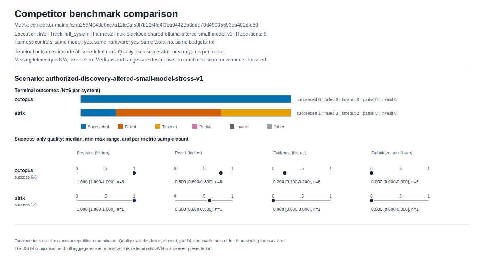

# Competitor benchmark track

This directory defines the publication contract for comparing OCTOPUS with
other systems in an authorized, resettable lab. It is a live/integration track,
not an extension of the built-in hermetic replay catalog.

The default `python -m core.benchmarks` command remains an in-process,
deterministic OCTOPUS regression benchmark. It does not launch OCTOPUS as a
scanner, call a model provider, use a network, or run a competitor. Never cite
its results as a system-to-system comparison.

## Layout

```text
benchmarks/competitors/
├── catalog.json  # reviewed upstream releases, revisions, licenses and tracks
├── campaigns/    # versioned live campaign scenarios
├── lab/          # immutable discovery-lab-v1 fixture
├── labs/         # newer immutable, allowlisted fixture definitions
├── systems/      # low-level system-manifest examples
├── scenarios/    # neutral scenario templates for the low-level matrix runner
└── results/      # immutable campaign publication bundles
```

The launcher writes generated manifests to ignored
`.benchmark-state/generated/<campaign-id>/`; it never writes them under
`systems/`.

The checked-in files ending in `.json.example` are templates. Copy and fill
them as `.json` before running a campaign; the suffix deliberately keeps them
out of normal JSON scenario/manifest discovery.

## Published live campaigns

The first checked-in live result is the complete, checksum-verified
[`linux-blackbox-small-model-v1-20260721t134205z`](results/linux-blackbox-small-model-v1-20260721t134205z/comparison.md)
bundle. It ran the authorized read-only discovery scenario six times per
system on one Linux host with the exact altered Qwen 9B model/digest, Ollama
0.18.3 and a 65,536-token context.

| System | Terminal outcomes | Successful-run recall | Successful-run evidence completeness |
| --- | --- | ---: | ---: |
| OCTOPUS | 6 succeeded | 0.8 (`n=6`) | 0.2 (`n=6`) |
| Strix 1.1.0 | 1 succeeded, 2 timed out at 600 s, 3 exited with code 1 | 0.6 (`n=1`) | 0.0 (`n=1`) |



The SVG above is a deterministic, non-normative derivative of the immutable
v1 bundle; the bundle itself remains byte-for-byte unchanged. Every newly
generated bundle embeds and checksums its own `comparison.svg` from
`comparison.md`, so GitHub renders the graph beside the report.

The campaign status is intentionally `completed_with_failures`: all 12 runs,
reset attestations, both aggregates and cleanup evidence are present, while
the five strict Strix outcomes remain in the publication. The quality values
above summarize successful runs only, so the Strix values are a single
observation rather than a stable median. No-op/repeated-task telemetry is
unavailable for both systems and is displayed as `—` (unavailable), not zero.

This is a one-scenario engineering small-model stress result, not a
statistical or vendor-representative ranking. Product-native prompts, APIs,
tools, tool versions and uniformly enforceable budgets are not identical; the
bundle therefore declares no automatic winner. The machine-readable matrix,
per-run outcomes, exact inputs and provenance are preserved beside the linked
report.

## Supported releases and comparison surfaces

`catalog.json` is the machine-readable review record for the competitor
selection as reviewed on 2026-07-18. A contract test requires its tags and
revisions to match the launcher and bootstrap pins, preventing silent drift
between those three inputs. The supported Linux black-box launcher
profiles are deliberately small:

| Profile | Systems | Surface |
| --- | --- | --- |
| `core` | OCTOPUS, Strix 1.1.0 | black-box, full-system |
| `extended` | `core` plus PentAGI 2.1.0 | black-box, full-system |

The pinned upstream releases are [Strix 1.1.0](https://github.com/usestrix/strix/releases/tag/v1.1.0),
[PentestGPT 1.0.0](https://github.com/GreyDGL/PentestGPT/releases/tag/v1.0.0),
[PentAGI 2.1.0](https://github.com/vxcontrol/pentagi/releases/tag/v2.1.0)
and [Shannon 1.9.0](https://github.com/KeygraphHQ/shannon/releases/tag/v1.9.0).
PentestGPT remains a cataloged CTF-only candidate: its v1.0.0 non-interactive
path hardcodes flag capture and retries no-flag results three times. It has no
launcher profile and must not contribute discovery results. Use the optional
bootstrap flag `--with-pentestgpt` only for a separately designed CTF campaign.
The bootstrap checks the full release commit recorded in `catalog.json`, not
only the human-readable tag.

Shannon requires the target source checkout and is therefore white-box only.
It is a cataloged candidate, not a runnable shipped campaign: no versioned
Shannon scenario or publication runbook is included yet. Do not add ad-hoc
Shannon numbers to the Linux black-box ranking. CAI is recorded only under `excluded` because
its [official license](https://github.com/aliasrobotics/cai/blob/main/LICENSE)
contains research-use restrictions and separate commercial-license terms, so
it is not part of this strict open-source comparison.

## Linux quick start

The supported launcher targets Linux x86_64 with glibc 2.34 or newer. Before
starting, install Git, Docker with Compose and an accessible running daemon,
CPython 3.12 and the model services or provider accounts you intend to use. GitHub and PyPI
egress are required during bootstrap. The bootstrap creates pinned
`uv==0.11.28`, syncs
the OCTOPUS `venv/` from the checked-in CPython 3.12 hashed runtime lock, and
then syncs the competitors from their frozen locks. It never invokes `sudo`,
never starts a target, and never performs an interactive competitor
configuration. It intentionally synchronizes an existing repo `venv/`; use a
dedicated benchmark checkout if that environment must not be changed.

Execute a live campaign only from a disposable, dedicated Linux VM on an
isolated VLAN. Give that VM no unrelated or long-lived credentials or sensitive
mounts; use only scoped, revocable benchmark provider keys. Never pass it a
Docker socket from a more privileged host. Give it no route to any
sensitive/private network other than the benchmark lab. Permit only the
Internet/provider egress required for bootstrap and the selected models.
Vendor agents can invoke their own tools or Docker workloads; process bounds
and target validation do not prove every internal tool action, so isolation is
a required safety boundary rather than optional hardening.

Prepare the default `core` competitors from exact detached source revisions:

```bash
cd /path/to/Octopus
./scripts/benchmarks/bootstrap_competitors_linux.sh --profile core
test -e benchmarks/competitors/secrets.env || \
  cp benchmarks/competitors/secrets.env.example benchmarks/competitors/secrets.env
chmod 600 benchmarks/competitors/secrets.env
```

Bootstrap also pulls and verifies the immutable Linux amd64 Strix sandbox
image recorded as `STRIX_IMAGE` in the template. Mutable tags and alternate
digests are rejected by the launcher.

Set
`OCTOBENCH_ACK_AUTHORIZED=YES` yourself only when the included OCTOBENCH fixture
or another explicitly authorized target is actually in scope. Set
`OCTOBENCH_ACK_ISOLATED_HOST=YES` yourself only after establishing the isolation
boundary above. The launcher requires both acknowledgements and
fails closed for any other value. The checked-in example
contains executable paths and variable names but no credentials. The launcher
detects one private host address and binds the lab only there;
standalone lab control defaults to `127.0.0.1`. Optional explicit host, bind
and port overrides are documented as comments in the template.

For the calibrated `linux-blackbox-small-model-v1` and multi-surface
`linux-blackbox-small-model-v2` definitions, use this exact
private env configuration. The two acknowledgement values below are valid only
after you have personally confirmed authorization and host isolation:

```dotenv
OCTOBENCH_ACK_AUTHORIZED=YES
OCTOBENCH_ACK_ISOLATED_HOST=YES

OCTOPUS_OLLAMA_URL=http://127.0.0.1:11434/api/generate
OCTOPUS_OLLAMA_MODEL=huihui_ai/qwen3.5-abliterated:9b
OCTOBENCH_OLLAMA_CONTEXT_LENGTH=65536
OCTOBENCH_OLLAMA_SERVER_VERSION=0.18.3
OCTOBENCH_OLLAMA_NUM_PARALLEL=1
OCTOBENCH_OLLAMA_MAX_LOADED_MODELS=1
OCTOBENCH_OLLAMA_FLASH_ATTENTION=1
OCTOBENCH_OLLAMA_KV_CACHE_TYPE=q8_0

OCTOBENCH_STRIX_BIN=.benchmark-tools/venvs/strix-1.1.0/bin/strix
STRIX_IMAGE=ghcr.io/usestrix/strix-sandbox@sha256:2e3a7e63a90428979ce34fbf80a8e83bb375d0d1146597a5d74087a259ee925c
STRIX_LLM=ollama/huihui_ai/qwen3.5-abliterated:9b
LLM_API_BASE=http://127.0.0.1:11434
LLM_API_KEY=
```

Both small-model definitions are intentionally separate altered-model stress
profiles. They require the exact tag
`huihui_ai/qwen3.5-abliterated:9b`, server version `0.18.3`, context `65536`,
flash attention `1`, and KV cache type `q8_0`; the live launcher also pins the
attested model digest and fails closed if any value differs.

The context field is an assertion and OCTOPUS override, not a way to mutate the
running Ollama service. For a systemd installation, use
`sudo systemctl edit ollama` to set the matching server default before launch:

```ini
[Service]
Environment="OLLAMA_CONTEXT_LENGTH=65536"
Environment="OLLAMA_FLASH_ATTENTION=1"
Environment="OLLAMA_KV_CACHE_TYPE=q8_0"
Environment="OLLAMA_NUM_PARALLEL=1"
Environment="OLLAMA_MAX_LOADED_MODELS=1"
```

Apply it, verify the effective service environment, and pull the exact model:

```bash
sudo systemctl daemon-reload
sudo systemctl restart ollama
systemctl show ollama -p Environment --no-pager
ollama pull huihui_ai/qwen3.5-abliterated:9b
```

Then assert that the exact benchmark endpoint is the pinned Ollama `0.18.3`
server:

```bash
curl -fsS http://127.0.0.1:11434/api/version |
  ./venv/bin/python -c 'import json,sys; v=json.load(sys.stdin)["version"]; print(v); raise SystemExit(0 if v == "0.18.3" else f"expected Ollama 0.18.3, got {v}")'
```

Do not substitute another returned version into the small-model env file: this
campaign definition intentionally fails closed unless it is `0.18.3`. Add the
configured Bearer header when the endpoint is authenticated. `ollama --version`
is only a local CLI sanity check and can target a different server. Limited-
VRAM systems may use CPU offload; inspect the loaded allocation with
`ollama ps`.

`LLM_API_KEY` is not needed for ordinary local Ollama. Define it only for an
authenticated shared endpoint; when present it is conditionally passed and
redacted from generated/public data. The launcher rejects a different host,
port or model, rejects `/api/generate` in `LLM_API_BASE`, and rejects the biased
`octopus-qwen` alias. OCTOPUS uses Ollama `/api/generate`, while Strix maps its
`ollama/` route to Ollama chat; the weights, model tag and runtime server are
shared, but each product retains its native request/prompt interface.
Before a live run, the launcher makes bounded, direct, no-proxy and no-redirect
requests to `/api/version` and `/api/tags`, performs an empty-prompt preload on
`/api/generate` after first unloading any stale runner, and reads `/api/ps`.
The cycle produces no text and invokes no tool; unloading prevents a runner
created with explicit request options from hiding the real server default. It
uses `Authorization: Bearer ...` only when `LLM_API_KEY` is set.
The exact configured tag, digest, server version and allocated context must
match, and `/api/ps` must contain no competing loaded model; the public
provenance records those values and model/VRAM byte sizes.
`OCTOBENCH_OLLAMA_NUM_PARALLEL=1` and
`OCTOBENCH_OLLAMA_MAX_LOADED_MODELS=1` are mandatory operator declarations:
Ollama does not expose those service settings through the API. Run the campaign
against a dedicated idle Ollama endpoint; provenance marks the declarations as
not independently API-attested.
Both `linux-blackbox-small-model-v1` and
`linux-blackbox-small-model-v2` additionally require and record
`OCTOBENCH_OLLAMA_FLASH_ATTENTION=1` and
`OCTOBENCH_OLLAMA_KV_CACHE_TYPE=q8_0`; these must match the service drop-in.
The context value is also passed to OCTOPUS, while Strix uses the verified
server default. Other inference defaults remain product-native and may differ.
A mismatch fails before the lab or product starts. Values below 32768 are
rejected; 65536 is recommended for agentic runs but may cause CPU offload on
limited-VRAM hardware. Strix upstream also
warns that local models below 70B often struggle with agentic tool use. A
sub-70B, distilled or altered/abliterated model is therefore a small-model
stress profile, not a vendor-representative score. Freeze that profile under a
distinct campaign version and label it explicitly. See Strix's official
[local-model guidance](https://docs.strix.ai/llm-providers/local).

Optionally inspect the exact generated manifests and campaign config without
running a system:

```bash
./venv/bin/python -m core.benchmarks.competitors.launch \
  --campaign-id linux-blackbox-small-model-v2-check \
  --campaign-definition linux-blackbox-small-model-v2 \
  --profile core \
  --environment-file benchmarks/competitors/secrets.env \
  --prepare-only
```

Three checked-in definitions are available. `linux-blackbox-v1` is the
backward-compatible default 300-second smoke contract. The explicitly selected
`linux-blackbox-small-model-v1` freezes the altered 9B model tag/digest,
Ollama 0.18.3, 65536-token context, q8_0 KV policy and a 600-second hard cap.
That cap is derived from one successful private pilot per system using
`ceil(max(product_duration_seconds) * 1.5 / 300) * 300`; this is an engineering
calibration, not a statistical claim or vendor-representative score. The v2
definition retains those runtime pins and adds four scenario-isolated surfaces:
linked navigation, OpenAPI contract discovery, same-origin relative redirects
and JSON hypermedia pagination. Its shared 900-second hard cap is derived with
the same 150%/300-second rule from the published v1 maximum successful duration
and its right-censored 600-second timeouts.

Use a fresh immutable ID for the repeated small-model campaign:

```bash
git status --short
CAMPAIGN_ID="linux-blackbox-small-model-v2-$(date -u +%Y%m%dt%H%M%Sz)"
./venv/bin/python -m core.benchmarks.competitors.launch \
  --campaign-id "$CAMPAIGN_ID" \
  --campaign-definition linux-blackbox-small-model-v2 \
  --profile core \
  --environment-file benchmarks/competitors/secrets.env

BUNDLE="benchmarks/competitors/results/$CAMPAIGN_ID"
./venv/bin/python -c \
  'import json,sys; from core.benchmarks.competitors.publication import verify_campaign_bundle; print(json.dumps(verify_campaign_bundle(sys.argv[1]), sort_keys=True))' \
  "$BUNDLE"
```

The verifier JSON must contain `"status": "verified"` before staging. The live launcher
already publishes the immutable bundle; Git publication is the final explicit
step:

```bash
git add "$BUNDLE"
git diff --cached --check
git diff --cached --stat
git commit -m "Publish competitor benchmark $CAMPAIGN_ID"
git push -u origin "$(git branch --show-current)"
```

`git status --short` must print nothing before a publishable run; the launcher
rejects a dirty attested source checkout. Ignored benchmark state and the
private env file do not appear there.

`--campaign-definition` selects the checked-in contract;
`--campaign-id` identifies one execution and all of its generated, journal and
published artifacts. Never reuse an ID across definitions. The v2 campaign is
48 runs (`4 scenarios × 2 systems × 6 repetitions`), normally about five to
six hours on the calibrated host, with a 12-hour absolute product-time ceiling.
Before paying for it on a new host, validate the multi-hop pagination surface
once per system. Start with Strix so an early product error does not consume
the matrix:

```bash
SCENARIO_ID="authorized-hypermedia-pagination-small-model-v2"
PILOT_ID="linux-blackbox-v2-pilot-strix-$(date -u +%Y%m%dt%H%M%Sz)"
./venv/bin/python -m core.benchmarks.competitors.launch \
  --campaign-id "$PILOT_ID" \
  --campaign-definition linux-blackbox-small-model-v2 \
  --profile core \
  --environment-file benchmarks/competitors/secrets.env \
  --diagnostic-pilot \
  --pilot-system strix \
  --pilot-scenario "$SCENARIO_ID" \
  --pilot-seconds 900
./venv/bin/python -m json.tool \
  ".benchmark-state/diagnostics/$PILOT_ID/summary.json"
find ".benchmark-state/diagnostics/$PILOT_ID/raw/strix" \
  -name product.log -print
```

Then run the OCTOPUS pilot under a fresh ID:

```bash
SCENARIO_ID="authorized-hypermedia-pagination-small-model-v2"
PILOT_ID="linux-blackbox-v2-pilot-octopus-$(date -u +%Y%m%dt%H%M%Sz)"
./venv/bin/python -m core.benchmarks.competitors.launch \
  --campaign-id "$PILOT_ID" \
  --campaign-definition linux-blackbox-small-model-v2 \
  --profile core \
  --environment-file benchmarks/competitors/secrets.env \
  --diagnostic-pilot \
  --pilot-system octopus \
  --pilot-scenario "$SCENARIO_ID" \
  --pilot-seconds 900
./venv/bin/python -m json.tool \
  ".benchmark-state/diagnostics/$PILOT_ID/summary.json"
find ".benchmark-state/diagnostics/$PILOT_ID/raw/octopus" \
  -name adapter.log -print
```

Run all four surfaces for both systems when you want an eight-run diagnostic
matrix before the full campaign:

```bash
for SYSTEM_ID in strix octopus; do
  for SCENARIO_ID in \
    authorized-linked-navigation-small-model-v2 \
    authorized-openapi-contract-small-model-v2 \
    authorized-relative-redirect-small-model-v2 \
    authorized-hypermedia-pagination-small-model-v2
  do
    PILOT_ID="v2-pilot-${SYSTEM_ID}-${SCENARIO_ID#authorized-}-$(date -u +%Y%m%dt%H%M%Sz)"
    ./venv/bin/python -m core.benchmarks.competitors.launch \
      --campaign-id "$PILOT_ID" \
      --campaign-definition linux-blackbox-small-model-v2 \
      --profile core \
      --environment-file benchmarks/competitors/secrets.env \
      --diagnostic-pilot \
      --pilot-system "$SYSTEM_ID" \
      --pilot-scenario "$SCENARIO_ID" \
      --pilot-seconds 900
    ./venv/bin/python -m json.tool \
      ".benchmark-state/diagnostics/$PILOT_ID/summary.json"
  done
done
```

The diagnostic command performs exactly one repetition for every selected
system/scenario pair. `--pilot-system` and `--pilot-scenario` independently
narrow that cross-product; without `--pilot-scenario`, a v2 pilot runs all four
surfaces for the selected system. `--pilot-seconds` is a per-run product cap,
not a whole-pilot cap. Separately bounded reset, health and cleanup work can
increase lifecycle wall time. The
command returns exit code 1 for a product/cleanup failure and 130 after an
operator interrupt, but still writes a summary and prints its path. The summary
contains only safe model/runtime identity, lab snapshot, manifest/config and
log digests, byte counts, and product/adapter/lifecycle durations.

The diagnostic directory and raw adapter/product logs are owner-only and
ignored by Git. Raw logs can contain provider or target output: never commit,
publish or attach them without manual redaction. A diagnostic summary is
explicitly marked `publishable: false` and must not be copied into a result
bundle. Campaign IDs cannot be shared between diagnostic and publication runs;
always use a fresh ID.

The shipped small-model definitions record their pilot/published-result-derived
rules and observations in their versioned strategy configs; raw
diagnostic summaries remain non-publishable. Do not silently change any
checked-in definition. Strix describes
`quick` as a minutes-scale mode, not a guaranteed five-minute completion cap;
see its official [scan-mode documentation](https://docs.strix.ai/usage/scan-modes).

The launcher writes bounded JSON progress events to stderr for campaign start,
each run start/finish, interruption and publication. Stdout remains reserved
for the final bundle path, so automation can capture it without parsing live
diagnostics. A failed product reports only a stable error class such as
`ProductExitCode1`; raw vendor output is never serialized into campaign state
or publication data and is represented in the public bundle only by a content
digest.

Use `--profile extended` only after a private/internal PentAGI endpoint is
configured as benchmark-dedicated infrastructure in the isolated segment, can
reach the private OCTOBENCH lab address, and the four
`OCTOBENCH_PENTAGI_*` fields are filled. The adapter fails closed unless the
service reports release `2.1.0`, the selected provider matches, and every model
actually used by the flow matches `OCTOBENCH_PENTAGI_MODEL`. Prepare its pinned
source checkout with `bootstrap_competitors_linux.sh --profile extended`; the
adapter also deletes its benchmark flow after capture and marks a failed
cleanup as `partial`. For a private HTTPS endpoint signed by an internal CA,
set the optional `OCTOBENCH_PENTAGI_CA_FILE`; its content digest is included in
runtime provenance. The bootstrap does not deploy or configure that service.
`--with-shannon` only
obtains a verified source candidate and does not create a publishable Shannon
campaign.

The launcher generates manifests and its campaign config under
`.benchmark-state/generated/<campaign-id>/`, resumes only matching work from
`.benchmark-state/journal/<campaign-id>/`, and publishes the complete bundle
under `benchmarks/competitors/results/<campaign-id>/`. Existing destinations,
changed fingerprints, missing executables, missing environment fields, an
unhealthy lab or an authorization acknowledgement other than `YES` fail
closed. A dirty repository is always rejected; the supported publication path
has no dirty-tree override.

Bootstrap and live execution are not free. Initial source downloads, Python
environments and container images can consume multiple gigabytes and take tens
of minutes. The balanced launcher runs six repetitions per system for both
profiles; a campaign can take tens of minutes to hours and
can incur model-provider, cloud and tool charges. The
launcher hard-bounds wall time and captured output. Vendor CLIs do not expose a
uniform enforceable token/tool/cost cutoff, so those declared budgets are
conformance targets, not spending guarantees; `same_budgets` is therefore
false for this full-system profile. Strix 1.1.0 additionally receives its
native `--max-budget-usd` limit, but that does not make the cross-system budget
contract uniform. Set independent provider-side spending
limits before a live run. With local Ollama, native dollar-cost telemetry may
be unavailable or zero even though compute is consumed, so the wall-time bound
remains the meaningful hard limit. Publish only the calls, tokens and cost actually
reported in the result bundle, leave unavailable values as `N/A`, and never
project one provider's price onto another system.

## Comparison tracks

Every system manifest declares one execution mode, one track and one fairness
profile. `live` launches the actual system in an authorized lab; `replay` runs
only immutable recorded inputs. A matrix rejects mixed execution modes, so
live and replay results cannot be compared as though they measured the same
thing.

The comparison tracks are:

- `framework_only`: all systems in the comparison group use the same model,
  model parameters, tool versions, hardware class, lab snapshot and budgets.
  This track is intended to isolate orchestration/framework behavior.
- `full_system`: each system retains its product-native orchestration and tools.
  A versioned fairness profile may control the model, as the shipped `core`
  profile does with shared Ollama/Qwen; remaining tool, hardware and budget
  differences stay explicit in manifests and results.

Do not merge, rank or average results across these tracks. A fairness profile
ID identifies systems that are eligible for a direct comparison. For a
`framework_only` group, all four `same_*` fields should be true and the recorded
model/tool values must match in substance, not merely by label.

## System manifest

Each system is declared with schema `1.0` from
`docs/schemas/benchmark-system-v1.schema.json`. A manifest pins:

- system ID, display name, release version, exact source revision and
  `live | replay` execution mode;
- comparison track and fairness profile;
- model identity/parameters and external tool versions;
- a command adapter, its working directory and names of environment variables
  that may be passed through;
- bounded, non-secret publication metadata.

`environment_passthrough` contains variable names only. Never commit tokens, passwords
or environment values. Adapter `argv` is an argument vector, not a shell
command, and must contain both `{scenario_path}` and `{output_path}`. It may
also use `{repetition}`, `{seed}` and `{system_id}`. `working_directory` is resolved relative
to the directory containing the manifest and cannot escape that directory.
Names beginning with `OCTOPUS_BENCHMARK_` are reserved for runner metadata and
cannot be listed in `environment_passthrough`.

See `systems/octopus-command.json.example` for a starting point. Give every
competitor its own manifest; do not hide a competitor version or configuration
behind a generic adapter name.

## Command adapter JSON protocol

For each repetition, the matrix runner materializes the exact benchmark
scenario JSON, allocates a fresh output path and starts the manifest's command
adapter. It also exposes repetition, seed, system and track through bounded
`OCTOPUS_BENCHMARK_*` environment metadata. The adapter must, for behavior it
can directly observe and control:

1. read the UTF-8 JSON scenario from `{scenario_path}`;
2. enforce target scope, hard time/output limits and the campaign reset
   contract, and report conformance only for observable action/tool/model/cost
   controls;
3. write exactly one bounded UTF-8 JSON object to `{output_path}`;
4. exit with status zero only after that object has been completely written.

The scenario's `max_seconds` remains the identical hard product-execution
budget for every system. The outer command runner allows a fixed five-second
control-plane grace after that budget only so the adapter can stop the product
and atomically write its final protocol object. The scenario passed to the
adapter is unchanged, the grace must not be used for product work, and duration
scoring is capped at `max_seconds`. The watchdog wall time is therefore bounded
by `min(max_seconds, 3600) + 5` seconds; an explicit runner timeout remains a
stricter absolute wall-clock cap. An adapter that reaches the product deadline
must report `timeout` or `partial`; it cannot turn work completed during the
protocol grace into a successful run.

The pinned Strix adapter uses its upstream `quick` scan mode, which is intended
for minutes-scale CI execution but does not guarantee completion within five
minutes. The selected mode is written to Strix's public system manifest; it is
not a hidden operator-controlled input. OCTOPUS continues to
receive the scenario's explicit iteration, tool and total time limits. Within
that same total time, the OCTOPUS adapter ends active scan work 20% early (at
most 60 seconds) and installs a cooperative cancellation deadline. The reserved
interval is used only to read its durable facts/trace and serialize the final
adapter object; it is proportionally smaller for short contract-test budgets.
Bound Ollama requests and retry waits use the remaining active interval, so a
late model call cannot consume the result-finalization reserve.

The output object uses the existing `BenchmarkRunner` mapping:

```json
{
  "status": "succeeded",
  "actions": ["observe_authorized_target", "verify_observed_service"],
  "reported_findings": ["service.https.443"],
  "verified_findings": ["service.https.443"],
  "coverage_gaps": [],
  "metrics": {
    "time_to_first_verified_seconds": 12.4,
    "evidence_completeness": 1.0,
    "no_op_task_rate": 0.0,
    "repeated_task_rate": 0.0,
    "tool_calls": 2,
    "model_calls": 1,
    "api_cost_usd": 0.12
  },
  "duration_seconds": 18.7,
  "artifact_refs": ["sha256:replace-with-content-digest"]
}
```

Action and finding IDs must be canonical campaign IDs. For shipped third-party
black-box agents, internal per-tool action conformance is `N/A` (`not
assessed`): the adapter must not fabricate an action stream or claim
enforcement it cannot prove. An observable adapter-controlled action may still
be checked against the scenario contract. The adapter performs product-specific
translation; a marketing label or free-form report sentence is not a finding
ID. The harness derives precision, recall and forbidden-hit metrics from the
scenario ground truth, so finding and coverage comparisons remain valid when
internal action conformance is unavailable. An observed undeclared
adapter-controlled action invalidates the run. A non-zero exit,
missing/oversized/malformed output, exhausted timeout or partial result is
published as a non-conforming run, not silently substituted with a zero score.

Diagnostic stdout/stderr must be bounded and scrubbed. Environment values,
manifest source paths and raw logs are execution-only data and are never
serialized into the benchmark aggregate. Published `artifact_refs` should be
content-addressed references, not raw credentials, prompts or target data.

## Neutral live scenarios

Competitor scenarios reuse benchmark scenario schema `1.0`, but live examples
belong under `benchmarks/competitors/scenarios/`, not the built-in replay
catalog. A valid campaign scenario must:

- name an explicitly authorized isolated lab and immutable target snapshot;
- use neutral objectives/actions that do not encode OCTOPUS implementation
  steps or product-specific tool names;
- define independently reviewed expected and forbidden canonical findings;
- declare hard and observational budgets explicitly, record fairness limits,
  and use at least five repetitions;
- include a seed and immutable/content-addressed fixture references;
- define reset-before-every-repetition behavior.

Restore the same lab snapshot before every repetition, clear product state and
caches, and verify lab health before starting the timed interval. The supported
launcher records a deterministic forward/reverse rotation: six repetitions in
either profile give every system every schedule position equally often.
Custom low-level campaigns must publish their own counterbalancing policy.
Preserve a failed reset as a campaign failure; do not continue on a
contaminated target.

`scenarios/authorized-service-inventory.json.example` is deliberately a
placeholder. Replace every `replace-with-*` value and keep public Internet
targets out of the repository.

## Repetitions, metrics and interpretation

Run at least five repetitions per system/scenario pair. Publish every run,
including failures and invalid runs, plus aggregate count, median, population
variance, minimum and maximum for successful-run metrics. The shipped adapters
always retain derived finding precision/recall, evidence completeness, total
duration and terminal status. Retain these additional metrics when the product
exposes trustworthy source events:

- verified-finding recall and reported-finding precision;
- forbidden-finding and policy-violation rates;
- time to first verified evidence and total duration;
- evidence completeness and coverage gaps;
- no-op and repeated-task rates from product task events;
- recovery success after declared transient failures;
- tool calls, model calls/tokens and normalized monetary cost.

Missing vendor telemetry remains `N/A`; it is never inferred from prose or
replaced with zero. In particular, no-op/repeated-task and recovery metrics are
not cross-system claims in the shipped black-box campaign because the selected
competitors do not expose a common task-event contract. OCTOPUS's separate
hermetic no-op/repeat comparison remains documented in the root README.
Third-party internal action conformance is likewise `N/A` (`not assessed`),
not a fabricated pass and not a launcher-enforced claim. This does not prevent
comparison of findings, verified evidence, precision/recall or coverage gaps
against the common ground truth.

There is no default overall winner. The matrix must present per-metric values,
sample counts, failures, execution mode and fairness metadata. Any later
weighted score is a separate, versioned analysis whose weights and
missing-data rules must be published. Never drop failed repetitions, compare
only each product's best run, combine live with replay, or combine incompatible
fairness profiles.

## Low-level matrix runner

The supported Linux runbook above should be used for the versioned
`linux-blackbox-v1` campaign. The lower-level matrix interface remains useful
for authoring or replaying a custom, already-controlled campaign. Create at
least two completed `.json` system manifests and one or more completed `.json`
scenarios. Example templates are not discovered because they end in
`.json.example`. Then run:

```bash
./venv/bin/python -m core.benchmarks.competitors \
  --system-manifest benchmarks/competitors/systems/octopus.json \
  --system-manifest benchmarks/competitors/systems/competitor-a.json \
  --scenario-directory benchmarks/competitors/scenarios \
  --output-directory benchmarks/competitors/results/2026-07-16-framework-v1 \
  --repetitions 5 \
  --strict
```

Use repeatable `--system-directory` instead of, or together with,
`--system-manifest` when every `*.json` file in a directory belongs to the
campaign. The destination must not already exist. Publication is atomic:
`--strict` still writes the complete result directory, then exits non-zero if
any run failed, timed out, was partial or invalid, or recorded a policy
violation. Timeout and partial counts are published separately and included in
`error_runs`. Inspect and publish that evidence rather than deleting the runs.

## Publication layout

Use one immutable campaign ID and keep inputs beside outputs:

```text
benchmarks/competitors/results/<campaign-id>/
├── aggregates/
│   ├── octopus/
│   ├── strix/
│   └── pentagi/               # extended profile only
├── attestations/             # reset/health evidence for every scheduled run
├── inputs/
│   ├── campaign.json
│   ├── scenarios/
│   └── systems/
├── campaign-status.json
├── comparison.json
├── comparison.md
├── comparison.svg          # deterministic GitHub-rendered outcome/quality graph
├── preflight.json
├── provenance.json
├── schedule.json
└── SHA256SUMS
```

`comparison.json` is the machine-readable matrix and embeds public system,
scenario, execution-mode, fairness and completeness metadata. It excludes
adapter commands, local paths, environment values and raw logs.
`comparison.md` is a non-normative rendering and deliberately declares no
winner. Schema 1.1 bundles embed `comparison.svg`; terminal-outcome bars use
all scheduled runs, while quality ranges use successful runs only and show a
separate per-metric `n`. Missing telemetry is `N/A`, never zero. Verification
canonically regenerates both Markdown and SVG before accepting the bundle.
Every full aggregate retains its runs under `aggregates/`; the bundle also
includes public input copies, the exact schedule, preflight, provenance,
per-run reset attestations and campaign status. `SHA256SUMS` covers every
publication file and the campaign verifies it before returning. Generated
runtime manifests remain under ignored `.benchmark-state/`; their sanitized
public forms are already preserved under `inputs/systems/`. Published result
directories are append-only: use a new campaign ID when any input, revision or
configuration changes.

Public provenance includes content digests only for the published campaign,
system and scenario inputs and for the benchmark controller sources. It never
publishes environment values or a direct digest for an individual environment
variable: unsalted hashes of low-entropy values such as private IPs, HOME,
PATH, ports and target URLs are reversible by enumeration. Environment values
still contribute to the aggregate campaign fingerprint used by the private
journal, so an interrupted campaign resumes deterministically and rejects
environment drift without exposing a per-variable hash oracle.

## Git publication workflow

Review artifacts for secrets and authorization-sensitive target data before
staging. A typical publication flow is:

```bash
cd /path/to/Octopus

git status --short
git diff --check

git add \
  benchmarks/competitors/results/<campaign-id>/

git diff --cached --check
git diff --cached --stat
git commit -m "Publish competitor benchmark <campaign-id>"
git push -u origin "$(git branch --show-current)"
```

Do not stage adapter logs, `.env` files, credentials or mutable lab images. A
published campaign is evidence, so corrections should add a superseding
campaign or a clearly linked erratum instead of rewriting old results.
