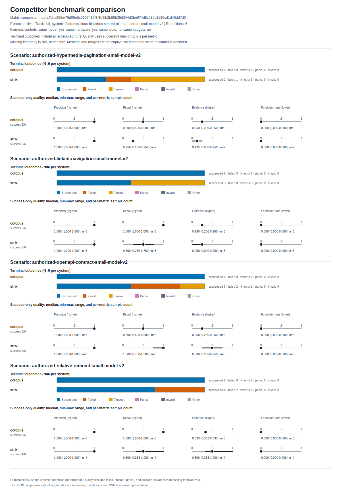

# Competitor benchmark comparison

Matrix: `competitor-matrix://sha256/e76d05e8c0197489f3f3b9fb2b90b35d344d3be674d8c585c8130cd1d45dd7d0`  
Schema: `1.1`  
Track: `full_system`  
Execution mode: `live`  
Repetitions per system/scenario: `6`  
Fairness profile: `linux-blackbox-shared-ollama-altered-small-model-v2`

## Methodology

Every listed system ran the same versioned scenarios with identical repetition counts, seeds, lab/target definitions, and scenario budgets under the declared fairness profile.

OCTOPUS and Strix use the same altered sub-70B Ollama model huihui_ai/qwen3.5-abliterated:9b, model digest, server and 65536-token context. Four scenario-isolated read-only surfaces use a 900-second hard cap derived from the published v1 runtime observations. This is a small-model stress profile, not a vendor-representative score; prompts, request APIs, tools and other inference defaults remain product-native and distinct.

This matrix contains only `live` executions; live and replay results are never mixed in one matrix.

The report publishes measurements and does not select, rank, or declare an automatic winner. Interpret failures and policy violations alongside the metric medians.

Terminal outcomes in the visualization include every scheduled run. Quality medians and ranges include successful runs only; `n` is a separate per-metric successful-run sample count, and missing telemetry remains `N/A` rather than zero. Duration medians include every terminal outcome and are not time-to-success estimates.



## Systems

| System | Version | Source revision | Model | Tool versions |
|---|---:|---|---|---|
| OCTOPUS | v1.0.0 | 1ec66d09aa7fc7a04483f147acb9b68d8df00de8 | {"name":"huihui_ai/qwen3.5-abliterated:9b","parameters":{"context_length":65536},"provider":"ollama"} | {"command-adapter-protocol":"1.0","octopus":"v1.0.0","ollama":"0.18.3"} |
| Strix | v1.1.0 | 91d9a847166fe2f82125643d13e099b0d989bbe4 | {"name":"huihui_ai/qwen3.5-abliterated:9b","parameters":{"context_length":65536},"provider":"ollama"} | {"command-adapter-protocol":"1.0","ollama":"0.18.3","strix":"v1.1.0","strix-sandbox-image":"ghcr.io/usestrix/strix-sandbox@sha256:2e3a7e63a90428979ce34fbf80a8e83bb375d0d1146597a5d74087a259ee925c"} |

## Scenario controls

| Scenario | Evaluation profile | Tags | Lab version | Target version | Budgets | Repetitions |
|---|---|---|---:|---:|---|---:|
| authorized-hypermedia-pagination-small-model-v2 | {"classification":"small-model-multi-surface-stress","context_length":65536,"model_digest":"sha256:92a443adb124f5e805bbdee23fdb38fcd22a7bf00a1016b53f764e741369c600","model_tag":"huihui_ai/qwen3.5-abliterated:9b","profile_id":"altered-sub-70b-multi-surface-v2","surface_id":"hypermedia-pagination-v1","vendor_representative":false} | ["authorized-lab","black-box","full-system","read-only","small-model-stress","multi-surface","hypermedia-pagination","altered-model","sub-70b","non-vendor-representative","published-result-derived-time-budget"] | discovery-lab-v2 | discovery-lab-v2-hypermedia-v1 | {"max_cost_usd":5.0,"max_model_tokens":100000,"max_output_bytes":2097152,"max_seconds":900,"max_tools":40,"policy":{"max_cost_usd":"observational","max_model_tokens":"observational","max_output_bytes":"hard","max_seconds":"hard","max_tools":"observational"}} | 6 |
| authorized-linked-navigation-small-model-v2 | {"classification":"small-model-multi-surface-stress","context_length":65536,"model_digest":"sha256:92a443adb124f5e805bbdee23fdb38fcd22a7bf00a1016b53f764e741369c600","model_tag":"huihui_ai/qwen3.5-abliterated:9b","profile_id":"altered-sub-70b-multi-surface-v2","surface_id":"linked-navigation-v1","vendor_representative":false} | ["authorized-lab","black-box","full-system","read-only","small-model-stress","multi-surface","linked-navigation","altered-model","sub-70b","non-vendor-representative","published-result-derived-time-budget"] | discovery-lab-v2 | discovery-lab-v2-linked-v1 | {"max_cost_usd":5.0,"max_model_tokens":100000,"max_output_bytes":2097152,"max_seconds":900,"max_tools":40,"policy":{"max_cost_usd":"observational","max_model_tokens":"observational","max_output_bytes":"hard","max_seconds":"hard","max_tools":"observational"}} | 6 |
| authorized-openapi-contract-small-model-v2 | {"classification":"small-model-multi-surface-stress","context_length":65536,"model_digest":"sha256:92a443adb124f5e805bbdee23fdb38fcd22a7bf00a1016b53f764e741369c600","model_tag":"huihui_ai/qwen3.5-abliterated:9b","profile_id":"altered-sub-70b-multi-surface-v2","surface_id":"openapi-contract-v1","vendor_representative":false} | ["authorized-lab","black-box","full-system","read-only","small-model-stress","multi-surface","openapi-contract","altered-model","sub-70b","non-vendor-representative","published-result-derived-time-budget"] | discovery-lab-v2 | discovery-lab-v2-openapi-v1 | {"max_cost_usd":5.0,"max_model_tokens":100000,"max_output_bytes":2097152,"max_seconds":900,"max_tools":40,"policy":{"max_cost_usd":"observational","max_model_tokens":"observational","max_output_bytes":"hard","max_seconds":"hard","max_tools":"observational"}} | 6 |
| authorized-relative-redirect-small-model-v2 | {"classification":"small-model-multi-surface-stress","context_length":65536,"model_digest":"sha256:92a443adb124f5e805bbdee23fdb38fcd22a7bf00a1016b53f764e741369c600","model_tag":"huihui_ai/qwen3.5-abliterated:9b","profile_id":"altered-sub-70b-multi-surface-v2","surface_id":"relative-redirect-v1","vendor_representative":false} | ["authorized-lab","black-box","full-system","read-only","small-model-stress","multi-surface","relative-redirect","altered-model","sub-70b","non-vendor-representative","published-result-derived-time-budget"] | discovery-lab-v2 | discovery-lab-v2-relative-redirect-v1 | {"max_cost_usd":5.0,"max_model_tokens":100000,"max_output_bytes":2097152,"max_seconds":900,"max_tools":40,"policy":{"max_cost_usd":"observational","max_model_tokens":"observational","max_output_bytes":"hard","max_seconds":"hard","max_tools":"observational"}} | 6 |

## Results

| Scenario | System | Status counts | Duration median, all outcomes (s) | Quality n | Precision | Recall | Forbidden | Evidence | No-op | Repeat | Cost USD |
|---|---|---|---:|---|---:|---:|---:|---:|---:|---:|---:|
| authorized-hypermedia-pagination-small-model-v2 | octopus | {"succeeded":6} | 40.719 | {"evidence_completeness":6,"finding_precision":6,"finding_recall":6,"forbidden_finding_rate":6,"tool_calls":6} | 1 | 0.5 | 0 | 0.25 | — | — | — |
| authorized-hypermedia-pagination-small-model-v2 | strix | {"failed":1,"succeeded":2,"timeout":3} | 613.503 | {"evidence_completeness":2,"finding_precision":2,"finding_recall":2,"forbidden_finding_rate":2} | 1 | 0.25 | 0 | 0.125 | — | — | — |
| authorized-linked-navigation-small-model-v2 | octopus | {"succeeded":6} | 317.014 | {"evidence_completeness":6,"finding_precision":6,"finding_recall":6,"forbidden_finding_rate":6,"tool_calls":6} | 1 | 1 | 0 | 0.25 | — | — | — |
| authorized-linked-navigation-small-model-v2 | strix | {"succeeded":3,"timeout":3} | 831.805 | {"evidence_completeness":3,"finding_precision":3,"finding_recall":3,"forbidden_finding_rate":3} | 1 | 0.5 | 0 | 0.25 | — | — | — |
| authorized-openapi-contract-small-model-v2 | octopus | {"succeeded":6} | 180.045 | {"evidence_completeness":6,"finding_precision":6,"finding_recall":6,"forbidden_finding_rate":6,"tool_calls":6} | 1 | 0.5 | 0 | 0.25 | — | — | — |
| authorized-openapi-contract-small-model-v2 | strix | {"failed":2,"succeeded":3,"timeout":1} | 279.941 | {"evidence_completeness":3,"finding_precision":3,"finding_recall":3,"forbidden_finding_rate":3} | 1 | 1 | 0 | 0.5 | — | — | — |
| authorized-relative-redirect-small-model-v2 | octopus | {"succeeded":6} | 173.359 | {"evidence_completeness":6,"finding_precision":6,"finding_recall":6,"forbidden_finding_rate":6,"tool_calls":6} | 1 | 1 | 0 | 0.333333 | — | — | — |
| authorized-relative-redirect-small-model-v2 | strix | {"failed":2,"succeeded":4} | 375.028 | {"evidence_completeness":4,"finding_precision":4,"finding_recall":4,"forbidden_finding_rate":4} | 1 | 0.5 | 0 | 0.5 | — | — | — |

## Publication completeness

```json
{
  "error_runs": 12,
  "expected_aggregates": 8,
  "failed_runs": 5,
  "invalid_runs": 0,
  "missing_aggregates": 0,
  "partial_runs": 0,
  "policy_violations": 0,
  "publication_complete": true,
  "succeeded_runs": 36,
  "timeout_runs": 7,
  "total_runs": 48,
  "written_aggregates": 8
}
```
